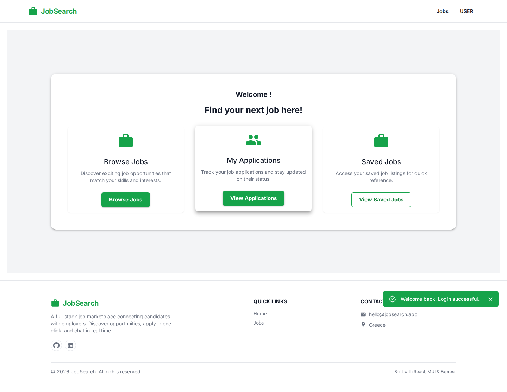
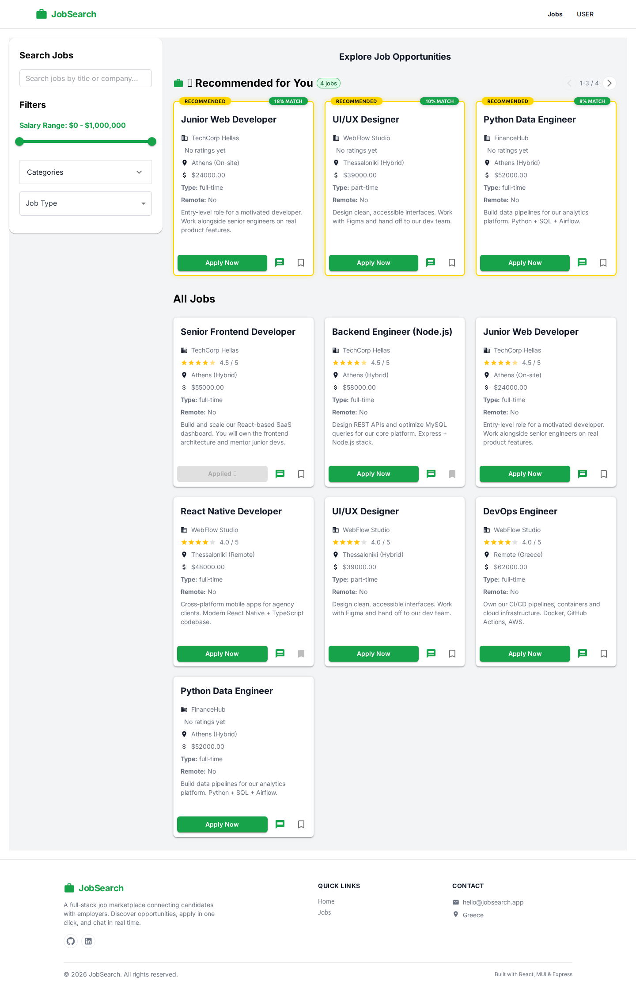
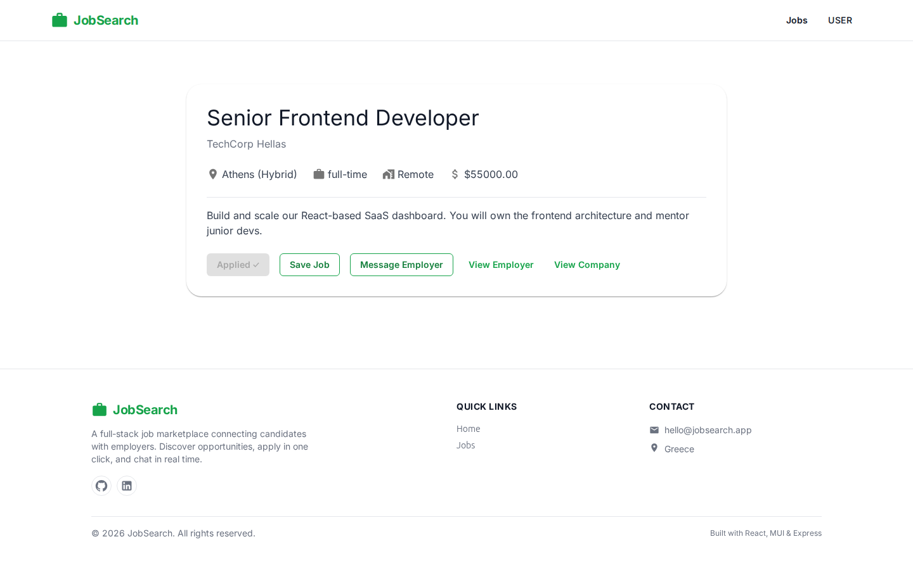
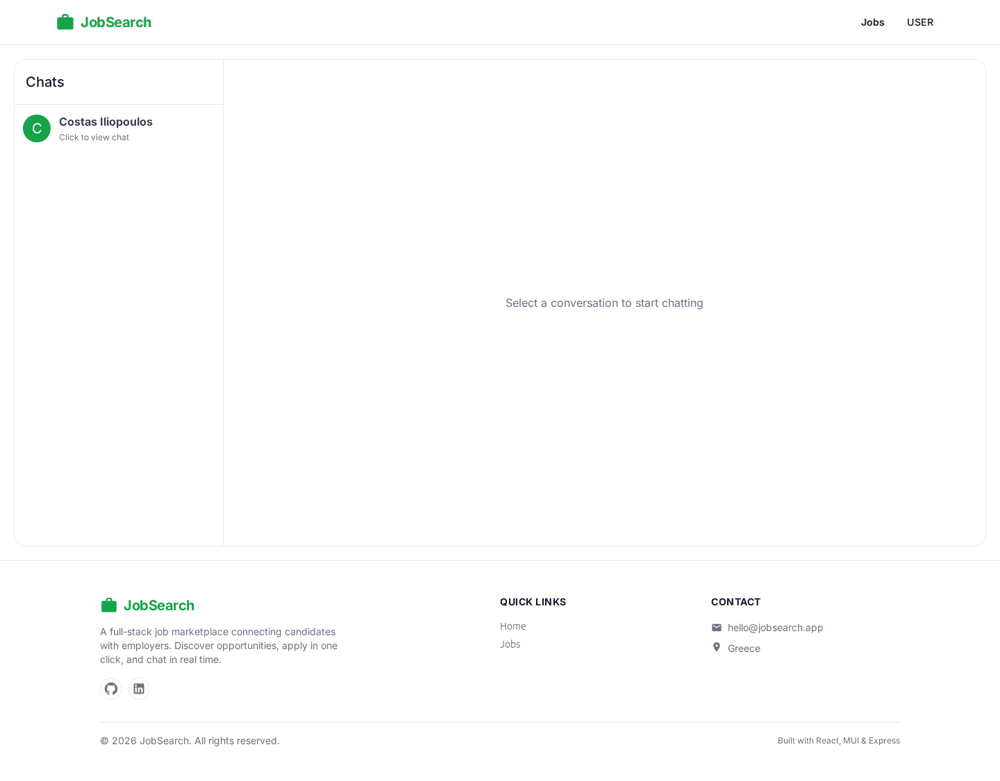
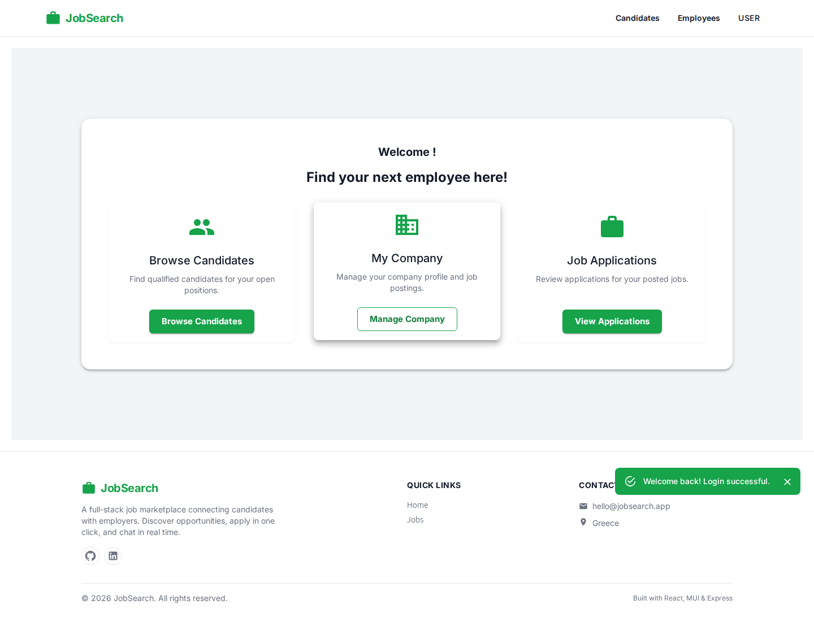
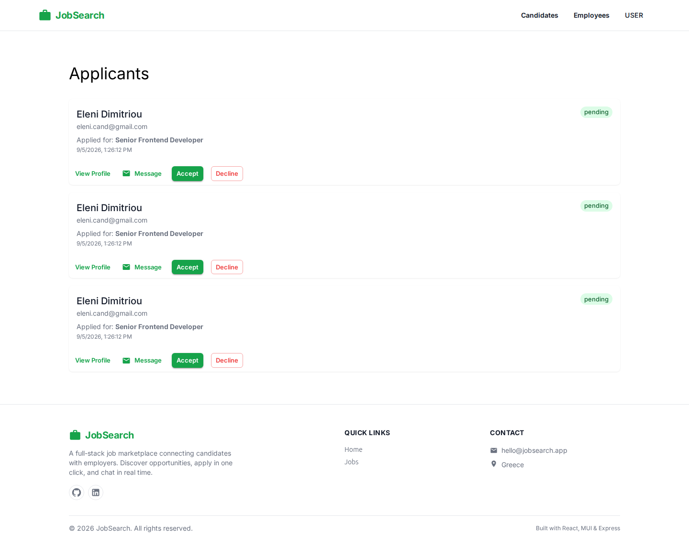
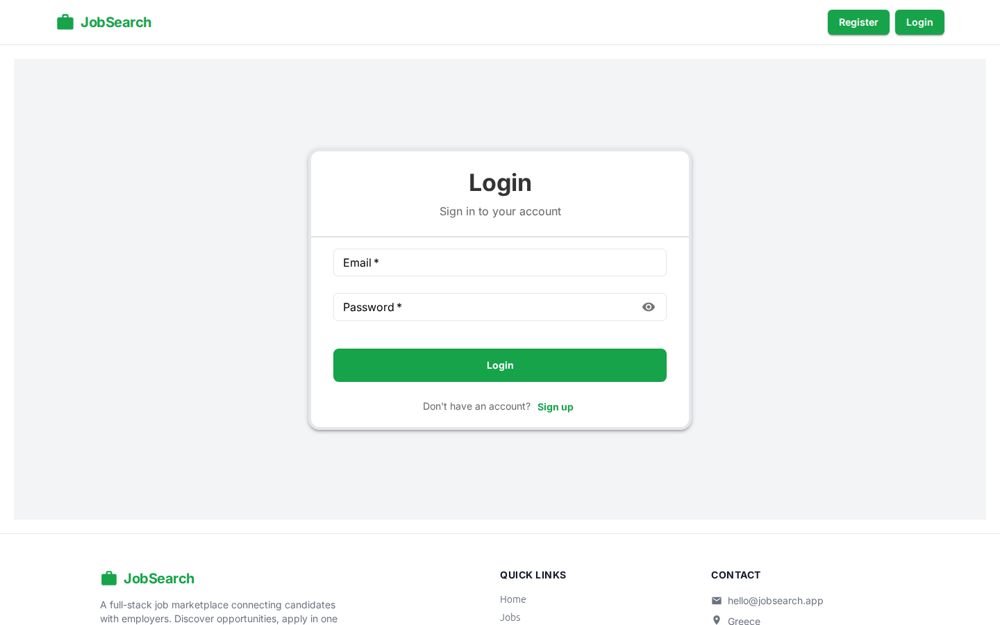
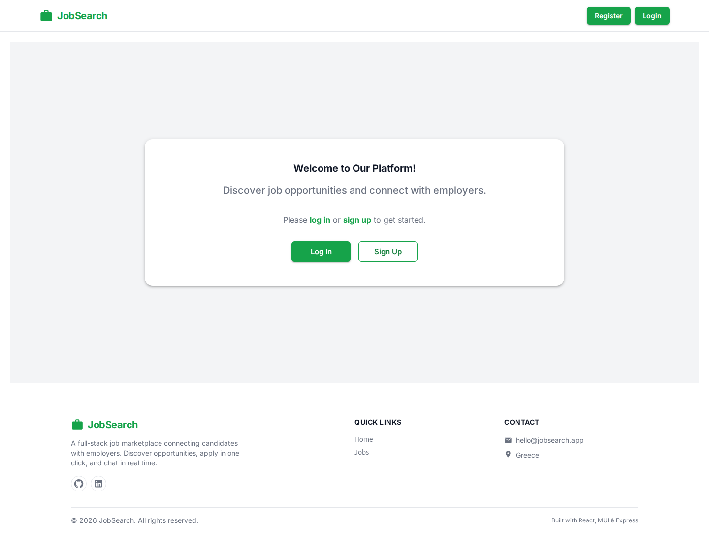
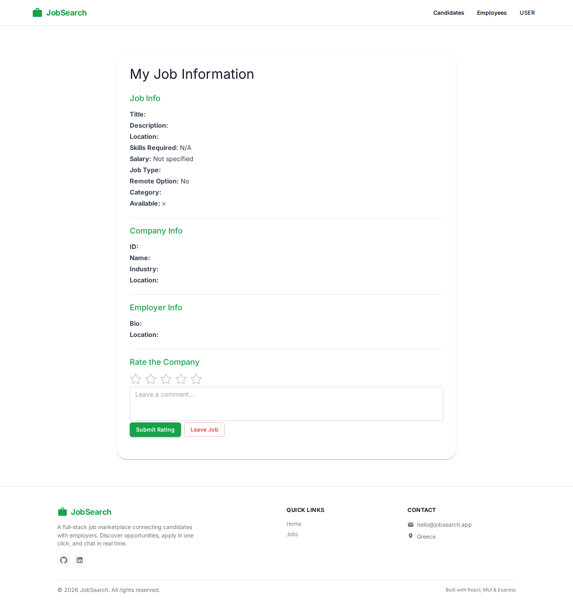

<div align="center">

# 🔍 JobSearch Platform

**A full-stack job marketplace with AI-powered matching, real-time chat, and production-grade security.**

[](LICENSE)
[](.github/workflows/ci.yml)
[]()
[]()
[]()
[]()

[Live Demo](#-live-demo) · [Features](#-features) · [Architecture](#-architecture) · [Getting Started](#-getting-started) · [Tech Stack](#-tech-stack) · [API](#-api-overview)

</div>

---

## 🎯 What is this?

A **LinkedIn-style job platform** with two user roles:

- **Candidates** — register, build a profile, browse & apply to jobs, chat with employers
- **Employers** — register a company, post jobs, review applicants, hire, message candidates

What makes it stand out from a typical tutorial project:

|                                  |                                                                                                        |
| -------------------------------- | ------------------------------------------------------------------------------------------------------ |
| 🤖 **AI semantic matching**      | Profile ↔ job similarity via HuggingFace transformers (real ML, not buzzwords)                         |
| 💬 **Real-time chat**            | Socket.io bidirectional messaging between candidates & employers                                       |
| 🔐 **Production-grade security** | JWT auth, role-based + resource-based authorization, rate limiting, helmet, audit log                  |
| 🧪 **Real tests**                | 23 backend (jest, mocked DB) + 7 frontend (vitest) — not boilerplate                                   |
| 🏗️ **CI/CD**                     | GitHub Actions: backend tests + frontend tests + production build + docker compose build on every push |
| 📦 **Clean deps**                | 0 npm audit vulnerabilities across backend + frontend, all transitive pinned via overrides             |
| 🏎️ **Modern stack**              | Vite 7 (5x faster than CRA), React 18, MUI 7, MySQL, Express                                           |
| 🎨 **Polished UI**               | Toast notifications, loading skeletons, empty states, smooth micro-interactions                        |

---

## ✨ Features

### 👤 For candidates

- **4-step registration wizard** (user info → profile → candidate details → ready)
- **Personalized recommendations** — AI-ranked jobs with match percentage score
- **Recommendation carousel** — 3-at-a-time slider with golden border highlights
- **Save & apply** to jobs with one click
- **Real-time chat** with employers
- **Search history** tracked automatically
- **Rate companies** you've worked with

### 🏢 For employers

- **Company + job posting** in 4 steps
- **Applicant dashboard** — see all who applied to your jobs
- **Accept/reject** applications, **hire** candidates
- **Employee management** (track current & past)
- **Real-time chat** with candidates
- **Candidate recommendations** based on job requirements

### 🎨 Modern UX

- **Toast notifications** — non-blocking feedback for all actions
- **Loading skeletons** — animated placeholders while data loads
- **Empty states** — helpful messages with CTAs when no data exists
- **Form validation** — real-time validation with helper text and visual cues
- **Micro-interactions** — smooth hover effects, button transitions, focus glow
- **Responsive design** — works on mobile, tablet, and desktop

### 🛡️ Security (the "boring" stuff that actually matters)

- **JWT authentication** with role-based authorization (candidate / employer)
- **Resource ownership** checks (you can only modify _your own_ resources — IDOR-safe)
- **Bcrypt** password hashing, never logged
- **Login rate limiting** (10 attempts / 15 min) + helmet() security headers
- **Audit log** — every login, failed attempt, and sensitive action recorded
- **Fail-fast** startup if JWT_SECRET is missing
- **No password hash leaks** in API responses (only safe fields)
- **Mass-assignment protection** — clients can't set their own role

---

## 📸 Showcase

Live capture from the running Docker stack — generated with the [Playwright capture script](screenshots/README.md).

| 🏠 Home (Candidate) | 📋 Jobs with AI Matching | 💼 Job Details |
|:---:|:---:|:---:|
|  |  |  |

| 💬 Messages (Real-time Chat) | 👔 Employer Dashboard | 📝 Applicants Management |
|:---:|:---:|:---:|
|  |  |  |

| 📄 Login Form | 🔙 Home (Not Logged In) | 💼 My Jobs |
|:---:|:---:|:---:|
|  |  |  |

---

## 🏗️ Architecture

```
┌─────────────────────────────────────────┐
│   Frontend (React 18 + Vite 7 + MUI 7)  │
│   - 16 pages, organized in folders      │
│   - React Context for auth              │
│   - Real-time socket.io client          │
│   - Toast notifications + skeletons     │
└────────────────┬────────────────────────┘
                 │  REST + JWT + WebSocket
                 ▼
┌─────────────────────────────────────────┐
│   Backend (Express 4 + Node 20)         │
│   - 14 route modules                    │
│   - 3 auth middlewares (authn + authz)  │
│   - Socket.io server for chat           │
│   - Background AI worker (semantic)     │
└────────────────┬────────────────────────┘
                 │  parameterized SQL
                 ▼
┌─────────────────────────────────────────┐
│   MySQL 8.0 (rootless Podman / Docker)  │
│   13 tables, referential integrity      │
└─────────────────────────────────────────┘
```

### Middleware stack

| Middleware                          | Purpose                                 |
| ----------------------------------- | --------------------------------------- |
| `authenticateToken`                 | Verify JWT, attach `req.user`           |
| `authorizeSelf(...params)`          | URL param must match authenticated user |
| `authorizeOwner(param, table, col)` | Lookup resource, verify ownership       |
| `requireRole(...roles)`             | Role-based access (e.g. employer-only)  |
| `auditMiddleware`                   | Capture every request to audit log      |

### Project structure

```
jobsearch/
├── BackEnd/                  Express server, routes, middleware
├── FrontEnd/                 Vite + React app (Dockerfile + nginx.conf)
├── .github/workflows/ci.yml  Backend + Frontend + Docker CI
├── docker-compose.yml        Dev stack (api / web / mysql / adminer)
├── .env.example
└── LICENSE                   MIT
```

---

## 🚀 Getting Started

### 🐳 Run with Docker (recommended) — one command for everything

```bash
git clone https://github.com/Alex247Git/jobsearch.git
cd jobsearch
docker compose --profile dev up --build
```

- Frontend → http://localhost:3000 · Adminer (DB GUI) → http://localhost:8080
- Demo login: `maria@techcorp.gr` / `Passw0rd!123`

No Docker, or prefer to run services manually? Follow the steps below.

### Prerequisites

- **Node.js** ≥ 20
- **MySQL** ≥ 8.0 (or run via Podman / Docker)
- **npm** ≥ 10

### 1. Clone

```bash
git clone https://github.com/Alex247Git/jobsearch.git
cd jobsearch
```

### 2. Start MySQL

```bash
docker run -d --name jobsearch-mysql -p 127.0.0.1:3306:3306 \
  -e MYSQL_ROOT_PASSWORD=jobsearchrootpass \
  -e MYSQL_DATABASE=jobsearch \
  -e MYSQL_USER=jobsearchuser \
  -e MYSQL_PASSWORD=jobsearchuserpassword \
  docker.io/library/mysql:8
```

### 3. Set up environment

```bash
cp .env.example .env
# Edit .env — set the STANDALONE BACKEND section (db.js has no defaults):
#   DB_HOST=localhost
#   DB_USER=jobsearchuser
#   DB_PASSWORD=jobsearchuserpassword
#   DB_NAME=jobsearch
# and JWT_SECRET to a long random string
```

### 4. Import schema

```bash
docker exec -i jobsearch-mysql mysql -uroot -pjobsearchrootpass jobsearch < schema.sql
```

### 5. Install & run

**Backend** (terminal 1) — use `backend:start`, not `npm start`:

```bash
npm install
npm run test:backend   # 23 jest tests with mocked DB
npm run backend:start  # http://localhost:5000
```

**Frontend** (terminal 2):

```bash
cd FrontEnd
npm install
npm test               # 7 vitest tests
npm start              # http://localhost:3000
```

---

## 🧪 Testing

- **Backend**: 23 jest tests with mocked DB (no live MySQL needed)
- **Frontend**: 7 vitest tests across 4 suites (App smoke, JobFilters, JobCard, MessageDialog)
- **CI**: All of the above + production build, on every push to `main`

---

## 🔑 Demo Accounts

| Email                 | Password     | Role      | Use Case                                |
| --------------------- | ------------ | --------- | --------------------------------------- |
| eleni.cand@gmail.com  | Passw0rd!123 | candidate | Full profile, recommendations, messages |
| costas.cand@gmail.com | Passw0rd!123 | candidate | Profile with applications               |
| alex.empty@gmail.com  | Passw0rd!123 | candidate | Empty states testing                    |
| sofi.fresh@gmail.com  | Passw0rd!123 | candidate | Profile creation flow                   |
| maria@techcorp.gr     | Passw0rd!123 | employer  | 3 jobs posted                           |
| nikos@webflow.gr      | Passw0rd!123 | employer  | 3 jobs posted                           |
| elena@fintech.gr      | Passw0rd!123 | employer  | 1 job (Data Engineer)                   |

---

## 🛠️ Tech Stack

| Layer             | Technology                  | Why                                     |
| ----------------- | --------------------------- | --------------------------------------- |
| **Frontend**      | React 18 + Vite 7           | 5x faster builds than deprecated CRA    |
| **UI library**    | MUI 7 + Emotion             | Accessible, themeable, production-grade |
| **Routing**       | React Router 6              | De-facto standard                       |
| **Real-time**     | Socket.io 4                 | Battle-tested WebSocket abstraction     |
| **Notifications** | MUI Snackbar + Context      | Non-blocking toast system               |
| **Backend**       | Express 4 + Node 20         | Simple, ubiquitous, well-supported      |
| **Database**      | MySQL 8                     | Relational data with strong integrity   |
| **Auth**          | jsonwebtoken + bcrypt       | Industry standard                       |
| **AI/NLP**        | @huggingface/transformers   | Local embeddings, no API key            |
| **Security**      | helmet + express-rate-limit | Headers + brute-force protection        |
| **CI/CD**         | GitHub Actions              | Free, integrated, fast                  |

---

## 📊 API Overview

All authenticated routes expect: `Authorization: Bearer <token>`

| Method | Endpoint                              | Auth     | Description                          |
| ------ | ------------------------------------- | -------- | ------------------------------------ |
| `POST` | `/users`                              | public   | Register — returns JWT               |
| `POST` | `/users/login`                        | public   | Login — returns JWT                  |
| `GET`  | `/users/:id`                          | self     | Get user profile (password stripped) |
| `PUT`  | `/users/:user_id`                     | self     | Update own profile                   |
| `GET`  | `/jobs`                               | public   | List all jobs                        |
| `GET`  | `/jobs/:id`                           | public   | Get job details                      |
| `POST` | `/jobs`                               | employer | Post a new job                       |
| `GET`  | `/recommendations/jobs/:candidate_id` | self     | Top matching jobs (AI)               |
| `GET`  | `/recommendations/candidates/:userId` | self     | Top matching candidates (AI)         |
| `POST` | `/recommendations/generate`           | auth     | Trigger generation                   |
| `GET`  | `/recommendations/status`             | auth     | Check status                         |
| `POST` | `/messages`                           | self     | Send message                         |
| `GET`  | `/messages/conversations/:user_id`    | self     | Your conversations                   |
| `POST` | `/applications`                       | self     | Apply to a job                       |
| `POST` | `/saved_jobs`                         | self     | Save a job                           |

_Self = authenticated + ownership checked against JWT._

---

## 🤖 How AI matching works

When a candidate registers, their profile is converted to a **vector embedding** using the `all-MiniLM-L6-v2` model (a local 90MB sentence-transformer). The same happens for every job posting.

```
                        JOBSEARCH SEMANTIC MATCHING PIPELINE
 ┌──────────────┐
 │   Trigger    │  startup · profile update · daily 3AM · POST /recommendations/generate
 └──────┬───────┘
        ▼
 ┌─────────────────────────────┐      ┌─────────────────────────────┐
 │  Candidate profile (MySQL)  │      │     Job postings (MySQL)    │
 │  title, skills, education,  │      │  title, description, type,  │
 │  certifications, languages  │      │  salary, location, remote   │
 └──────┬──────────────────────┘      └──────┬──────────────────────┘
        │ composeText()                       │ composeText()
        │ "Title: ... Skills: ..."            │ "Title: ... Skills: ..."
        ▼                                     ▼
 ┌─────────────────────────────────────────────────────────────────┐
 │        @huggingface/transformers  ·  Xenova/all-MiniLM-L6-v2    │
 │        (local ONNX Runtime — 384-dim embeddings, mean pooling)  │
 └──────┬──────────────────────────────────────┬───────────────────┘
        │ candidate vector                      │ job vectors
        ▼                                       ▼
 ┌─────────────────────────────────────────────────────────────────┐
 │   Cosine similarity (batch, normalized vectors)                 │
 │   score = dot(a,b) / (|a|·|b|)                                  │
 └────────────────────────────┬────────────────────────────────────┘
                              ▼
 ┌─────────────────────────────────────────────────────────────────┐
 │   normalizeScore(): threshold 0.5 → rescale to 0–10             │
 └────────────────────────────┬────────────────────────────────────┘
                              ▼
 ┌─────────────────────────────────────────────────────────────────┐
 │   MySQL `recommendations` table (ON DUPLICATE KEY upsert)       │
 │   → served via GET /recommendations (job + candidate side)      │
 └─────────────────────────────────────────────────────────────────┘
```

1. **Profile + Job → Embedding** — text converted to 384-dim vector
2. **Cosine similarity** — between job vector and candidate vector
3. **Score normalization** — scaled to 0-10 match score
4. **Top results** — sorted by score, returned with percentage match

### Triggers

| Event                   | Action                           |
| ----------------------- | -------------------------------- |
| Server startup          | Generate all recommendations     |
| Profile created/updated | Regenerate for that user         |
| Daily (3 AM)            | Refresh all recommendations      |
| Manual                  | `POST /recommendations/generate` |

The model runs **locally** via ONNX Runtime — no API keys, no per-request costs, no data leaving your server.

Smoke-tested: a frontend resume scores **1.78** vs **0.15** for an unrelated candidate on a frontend-dev job.

---

## 🛡️ Security Posture

| Threat           | Status                                                                |
| ---------------- | --------------------------------------------------------------------- |
| SQL injection    | ✅ Parameterized queries + whitelist in `authorizeOwner`              |
| Password storage | ✅ Bcrypt, never logged, never returned                               |
| Brute force      | ✅ Login rate limit (10/15min per IP)                                 |
| IDOR             | ✅ Three-layer authz: URL param, body field, resource ownership       |
| XSS              | ✅ React default-escapes + helmet headers                             |
| Mass assignment  | ✅ Role/verification not user-updatable                               |
| Secret leak      | ✅ `.env` gitignored, fail-fast on startup                            |
| CSRF             | ✅ N/A (token in header, not cookie)                                  |
| npm audit        | ✅ Backend 0, frontend 0 (pinned to react-router-dom 6.30.3-pre-v6.0) |

---

## 📈 Roadmap

Priorities we'd tackle next:

1. Refresh tokens with rotation
2. Layered architecture (services + repositories)
3. Structured logging + Sentry

---

## 📄 License

MIT — see [LICENSE](LICENSE).

---

## 🔗 More From Me

Also part of my portfolio:

- 🗺️ [Alumni Career Map](https://github.com/Alex247Git/alumni-career-map) — PHP (Slim) + Leaflet alumni job-mapping platform
- 🔥 [Autonomous Firefighting Simulation](https://github.com/Alex247Git/autonomous-firefighting-simulation) — Mesa agent-based wildfire simulation in Python
- 🌐 [Portfolio](https://alex247git.github.io/) — live overview of all my projects

<div align="center">

**If this helped you, consider giving it a ⭐**

Made with ☕ by [Alex247Git](https://github.com/Alex247Git)

</div>
